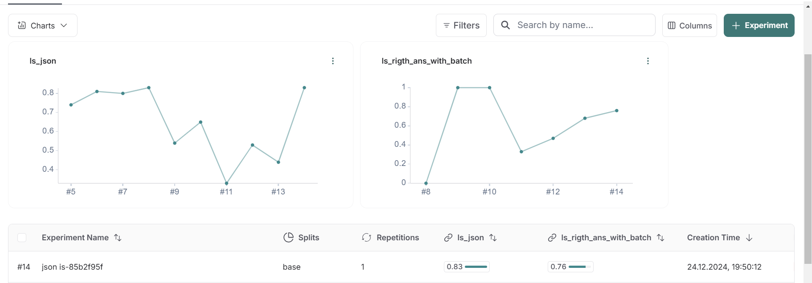

# DS HoundApp

Проект представляет из себя интеллектуального ассистента на основе RAG системы, который поможет находить полезную информацию в истории поиска в браузере и ориентироваться в большом количестве вкладок. Проект будет реализован в виде веб-интерфейса (сайт и расширение для браузера).

## Команда

- **Агапитов Денис** – PM  
  [Telegram](https://t.me/denisadmn) | [GitHub](https://github.com/koshkidadanet)

- **Еншов Владимир** – DS  
  [Telegram](https://t.me/Walde_mare) | [GitHub](https://github.com/Astra42)

- **Царева Екатерина** – NLP Engineer  
  [Telegram](https://t.me/katyatsr) | [GitHub](https://github.com/EKaterinaTR)

- **Капралов Александр** – Frontend  
  [Telegram](https://t.me/Lihten) | [GitHub](https://github.com/MrPALpi)

- **Никита** – Backend  
  [Telegram](https://t.me/gabbhack) | [GitHub](https://github.com/gabbhack)

# Описание репозитория

### сhromadb.ipynb  
Содержит пример интеграции Chromadb для векторного поиска и индексирования.

### generate_dataset.ipynb
Скрипт для генерации датасета, разбитый на 2 этапа.  

- Первый этап - генерация релевантного вопроса и выбор текстовых батчей, используя которые можно ответить на вопрос
- Второй этап - генерация ответа на сгенерированный вопрос, используя релевантные текстовые батчи

Этот ноутбук отвечает за автоматизированную загрузку, очистку и первичную обработку текста из разных источников. В нем представлены функции для парсинга веб-страниц, нормализации и фильтрации контента, а также сохранения итоговых данных в удобном формате для последующего использования.

### giga_chat.ipynb
Содержит эксперименты с классом для опроса API модели GigaChat для чат-интерфейса. Ноутбук демонстрирует пошаговую инициализацию, работу с API для генерации ответов и логику предобработки/постобработки.

### langsmith.ipynb
Использование LangSmith вычисления метрик и анализа качества RAG системы.

### mistral_chat.ipynb
Содержит эксперименты с классом для опроса API модели Mistral для чат-интерфейса. Данная модель выбрана с целью заменить GigaChat, так как он не хочет общаться ни на какие темы.

### datasets

#### dataset_url_batches_and_question_edited2.json  
Текстовые батчи для каждого url + сгенерированный вопрос по ним + список из id релевантных батчей, которые требуется использовать для ответа на поставленный вопрос

#### datasets/full_dataset.json  
Полный сгенерированный датасет после второго этапа. Второй этап подразумевал генерецию ответа на вопрос, используя релевантные батчи. Добавлены поля "answer" и "answer_sources"

#### datasets/output.jsonl  
Выходные данные с результатами обработки и генерации ответов.

## Метрики

В скрипте `langsmith.ipynb` на сгенерированном датасете подсчитаны следующие метрики:

- Соответствие ответа llm формату json - **0.83**
- Модельная оценка близости ответа к эталонному - **0.76**

